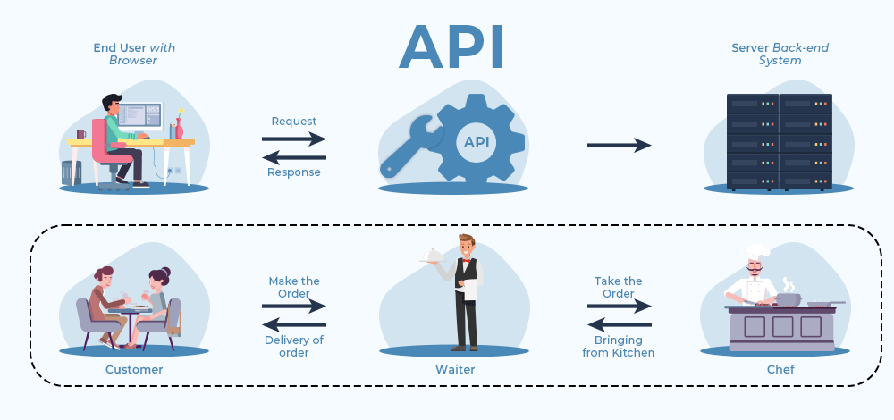

# DRF-Tutorial
Django Rest Framework Mohirdev course.


# API NIMA?

> [!NOTE]
> API (`Application Programming Interface`) bu dasturlash interfeysi bo'lib, u ikki yoki undan ortiq dastur yoki tizim o'rtasidagi o'zaro aloqa qilishga imkon beradi. API orqali bir dastur boshqa bir dasturga qanday funksiyalarni chaqirish, qanday ma'lumotlarni jo'natish yoki qabul qilish kerakligini belgilaydi.



## HTTP verbs, endpoints and status codes
`https://www.google.com/maps` - **URL**

`https` - **schema**

`www.google.com` - **hostname** 

`/maps` - **optional path** <br>

### HTTP METHODS - CRUD OPERATSIYALARI
- **CRUD** - bu `Create`, `Read`, `Update`, `Delete` qisqartmasi bo‘lib, ko‘plab dasturlarda ma’lumotlar bilan ishlashning asosiy operatsiyalarini ifodalaydi. Ushbu to‘rt amal ko‘pincha ma’lumotlar bazasi yoki boshqa ma’lumotlar saqlovchi tizimlar bilan ishlashda qo‘llaniladi.
    - CREATE - POST request
        - Yangi ma'lumot yaratish.
        - Ma'lumotlar bazasida yangi qator qo‘shish yoki API orqali yangi resurs yaratish.
        - Masalan, foydalanuvchi ro‘yxatdan o‘tganida yangi foydalanuvchini yaratiladi.
        - HTTP metod: `POST`.
    - READ - GET request
        - Ma'lumotlarni `o‘qish` yoki `ko‘rish`.
        - Ma'lumotlar bazasidan yoki `API` orqali ma'lumotni olish.
        - Masalan, foydalanuvchilar ro'yxatini olish yoki ma’lum bir foydalanuvchi haqida ma’lumot olish.
        - HTTP metod: `GET`.
    - UPDATE - PUT(PATCH)
        - Mavjud ma'lumotni yangilash.
        - Ma'lumotlar bazasida mavjud yozuvni o‘zgartirish yoki API orqali mavjud resursni yangilash.
        - Masalan, foydalanuvchi profilini yangilash.
        - HTTP metod: `PUT` yoki `PATCH`.
    - `DELETE` - DELETE
        - Mavjud ma'lumotni o'chirish.
        - Ma'lumotlar bazasidan yozuvni o'chirish yoki `API` orqali resursni o'chirish.
        - Masalan, foydalanuvchini o'chirish.
        - HTTP metod: `DELETE`.

WEBSITE - HTML, CSS, IMAGES, 

WEB API - endpoints - URL lar to'plami
1. https//www.mysite.uz/api/books - GET request - barcha kitoblarni jo'natadi.
2. https//www.mysite.uz/api/books/<id> - birgina kitobni (`id ga ko'ra`) jo'natadi.
3. https//www.mysite.uz/api/users/ - GET request barcha foydalanuvchilarni jo'natadi.
4. https//www.mysite.uz/api/books/ - kitobni nomi, muallifi, page, narxi, isbn
```python
{
    'title':'Kecha va kunduz',
    'author':"Cho'lpon"
}
```

http request 3ta kampanentdan tashkil topgan bo'ladi.
